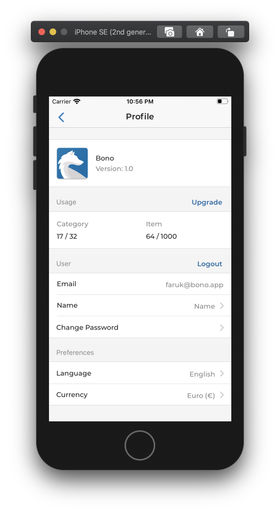

# BONO - Basic Expense Manager

This is a simple Expo + Firebase project for basic Expense management. It includes:

- based on Expo SDK `38.x.x`
- navigation using `react-navigation` 3.11.0
- Firebase as backend for email auth (login & register & logout)
- category and item CRUD structure with Firebase
- custom and reusable components
- handles different field types in forms


#### Some scenes from the application.

Login Screen | Register Screen
:-------------------------:|:-------------------------:
          |  
     |  
   |  
        |

## Installation

1. Install node modules using Yarn.
```bash
$ yarn
```
2. Update `firebaseConfig.js` file at src/config/firebase folder with your own configuration
```js
export default {
  apiKey: "",
  authDomain: "",
  databaseURL: "",
  projectId: "",
  storageBucket: "",
  messagingSenderId: "",
  appId: "",
  measurementId: ""
};
```
3. Start Expo Project
```bash
$ expo start
```

## Screens

- Login / Register
- Categories
- New / Update Category
- New / Update Item
- Profile

###### Async Stored Data

- isSync (bool)
- Categories (JSON)
- Items (JSON)
- Currency (String)
- Language (String)

###### Firebase Stored Data

- Categories (JSON)
- Items (JSON)
- Email
- Name